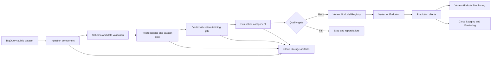
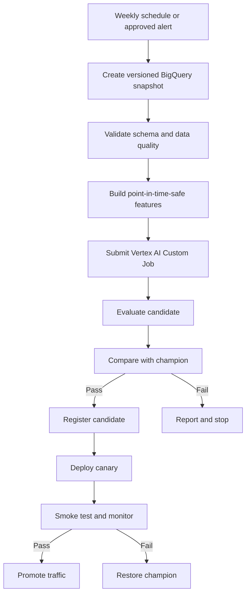
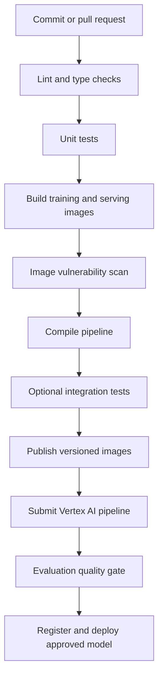

# Census Adult Income ML Platform

## 1. Objective

Build an end-to-end income classification system for:

`bigquery-public-data.ml_datasets.census_adult_income`

The system will ingest data, validate and transform features, train and evaluate a model, register and deploy the model, and monitor it after deployment. All managed ML workflow services will run on Google Cloud Vertex AI, with Kubeflow Pipelines used through Vertex AI Pipelines.

The initial prediction target is the dataset's income class/label. The exact target column and feature types must be confirmed during the schema-validation step rather than assumed in application code.

## 2. GCP Configuration

```text
PROJECT_ID     = rta-genai-explorations-406d
REGION         = europe-west1
STAGING_BUCKET = gs://rta-genai-explorations-406d-staging
```

These values should be supplied through environment variables, pipeline parameters, or a configuration file that is excluded from secrets. The project ID and bucket URI are identifiers, not secret credentials. Authentication should use Application Default Credentials locally and the appropriate Vertex AI service accounts in GCP.

Recommended Artifact Registry repository:

```text
LOCATION-docker.pkg.dev/PROJECT_ID/income-prediction
```

Container image names and tags should include the Git commit SHA or another immutable version identifier.

## 3. Proposed Architecture



### Core services

| Responsibility | Service or artifact |
|---|---|
| Source data | BigQuery public dataset |
| Pipeline orchestration | Vertex AI Pipelines / Kubeflow Pipelines |
| Pipeline artifacts | Cloud Storage |
| Training and evaluation | Vertex AI Custom Jobs using a custom training image |
| Container storage | Artifact Registry |
| Model versioning | Vertex AI Model Registry |
| Online inference | Vertex AI Endpoint using a custom serving container |
| Monitoring | Vertex AI Model Monitoring, Cloud Logging, Cloud Monitoring |
| Permissions | IAM service accounts and least-privilege roles |
| CI/CD | Cloud Build or GitHub Actions, selected during implementation |

### Senior-level design decisions by layer

| Layer | Decisions to make for this system |
|---|---|
| Data | Source contract, snapshot strategy, privacy boundaries, sampling, freshness, and whether BigQuery SQL is sufficient or Dataflow is justified |
| Features | Which fields are predictive and permissible, leakage prevention, missing-value policy, categorical encoding, and offline/online consistency |
| Training | Baseline algorithm, class-imbalance treatment, reproducible splits, hyperparameter search, resource sizing, and experiment metadata |
| Evaluation | Primary business metric, minimum quality thresholds, calibration, subgroup performance, error analysis, and promotion criteria |
| Registry | Artifact compatibility, metadata, lineage, semantic versioning, approval status, and rollback target |
| Deployment | Batch versus online inference, latency and cost targets, replica policy, authentication, canary strategy, and API contract |
| Monitoring | Data quality, drift, service health, prediction quality, fairness signals, alert thresholds, and ownership of incidents |
| Retraining | Trigger policy, data window, evaluation comparison against the champion, approval workflow, and safe rollback |

This table is an implementation checklist: each decision should become a configuration parameter, validation rule, test, or documented operational decision rather than remaining implicit in notebook code.

## 4. Repository Structure

The implementation should follow a component-oriented structure similar to:

```text
.
├── ARCHITECTURE.md
├── README.md
├── pyproject.toml
├── requirements-dev.txt
├── configs/
│   └── pipeline.yaml
├── pipelines/
│   ├── pipeline.py
│   └── compile_pipeline.py
├── components/
│   ├── ingest/
│   ├── validate/
│   ├── preprocess/
│   ├── evaluate/
│   └── register/
├── training/
│   ├── train.py
│   ├── Dockerfile
│   └── requirements.txt
├── serving/
│   ├── app.py
│   ├── Dockerfile
│   └── requirements.txt
├── tests/
│   ├── unit/
│   └── integration/
├── infrastructure/
│   └── iam-and-services.md
└── scripts/
    ├── build_images.sh
    └── run_pipeline.sh
```

The final names can be adjusted to match the implementation, but pipeline components, training code, serving code, and tests should remain independently testable.

## 5. Pipeline Workflow

The pipeline should be parameterized with the project ID, region, staging bucket, image URIs, dataset reference, model name, endpoint name, and evaluation thresholds.

### Step 1: Ingest

- Read the public BigQuery table with a parameterized SQL query.
- Select only the required columns.
- Record the source table, query, row count, and schema version.
- Write a reproducible snapshot or pipeline artifact to Cloud Storage when needed.
- Avoid embedding credentials in code; use the pipeline's runtime service account.

### Step 2: Validate

- Verify that required columns exist.
- Identify the target column and expected label values.
- Check null rates, duplicate rows, invalid categories, and numeric ranges.
- Detect an empty or unexpectedly small dataset.
- Fail the pipeline early when data contracts are violated.
- Persist a validation report as a pipeline artifact.

### Step 3: Preprocess and split

- Separate features from the target before fitting transformations.
- Use a reproducible train, validation, and test split.
- Fit preprocessing only on the training split to prevent data leakage.
- Encode categorical features and handle missing values consistently.
- Persist the fitted preprocessing artifact with the model or in a versioned artifact location.
- Preserve feature ordering and names for serving-time validation.

A scikit-learn `Pipeline` or equivalent single preprocessing object should be preferred so training and serving use the same transformation logic.

### Step 4: Train

- Submit a Vertex AI Custom Job using the custom training container.
- Load the prepared training artifact.
- Train the selected baseline classifier, such as logistic regression or gradient-boosted trees.
- Log hyperparameters, dataset metadata, and training metrics.
- Write the model artifact to the Vertex AI expected output location.
- Make the training entry point runnable locally for unit tests.

The first model should prioritize reproducibility and a clear baseline. More advanced models can be introduced after the pipeline contract and evaluation gate are stable.

### Step 5: Evaluate

For this classification problem, report at least:

- Accuracy
- Precision, recall, and F1 score
- ROC AUC when probability outputs are available
- Confusion matrix
- Per-class metrics
- Threshold-dependent metrics if the serving API exposes a configurable threshold

The evaluation component should compare metrics against pipeline parameters. It must fail or block registration when required thresholds are not met.

### Step 6: Register

- Register only models that pass validation and evaluation gates.
- Store model metadata, training image URI, source revision, feature schema, preprocessing version, and evaluation metrics.
- Use immutable model versions and descriptive labels.
- Keep the model artifact and preprocessing artifact coupled so they cannot silently diverge.

### Step 7: Deploy

- Upload the model to Vertex AI with the custom serving container.
- Deploy the approved model version to a Vertex AI Endpoint in `europe-west1`.
- Configure machine type, minimum and maximum replicas, traffic allocation, and health checks.
- Support staged rollout by deploying a new version separately before shifting traffic.
- Test the endpoint with a known-good request before marking deployment successful.

The serving container should implement the Vertex AI prediction contract, validate request shape and feature names, apply the stored preprocessing artifact, return predictions and probabilities, and emit useful structured logs without logging sensitive input unnecessarily.

### Step 8: Monitor

Monitor both system and model behavior:

- Request count, latency, error rate, and replica health through Cloud Monitoring.
- Input feature drift and training-serving skew through Vertex AI Model Monitoring where supported.
- Prediction distribution changes.
- Missing or invalid feature rates.
- Label-based performance after ground-truth labels become available.
- Data freshness and pipeline failures.

Monitoring should produce alerts with actionable thresholds. A retraining workflow can be triggered manually initially, then automated after alert quality has been established.

### Monitoring and retraining policy

Retraining should not be triggered by drift alone. A recommended policy is:

1. Validate data quality and freshness before starting a run.
2. Trigger a candidate run on a schedule or after a sustained drift/performance alert.
3. Train the candidate on a defined data window and compare it with the deployed champion.
4. Require the candidate to pass quality, calibration, subgroup, and operational checks.
5. Register the candidate with an approval state rather than immediately shifting production traffic.
6. Deploy to a test endpoint or canary allocation, verify health and prediction behavior, then promote.
7. Roll back traffic to the previous model version when service or quality thresholds are violated.

The first implementation should use scheduled or manually approved retraining. Automated retraining should be enabled only after alert thresholds, evaluation stability, and cleanup behavior have been demonstrated.

### Feature engineering and Feature Store decision

This project can initially use BigQuery for offline feature computation and a serialized preprocessing pipeline bundled with the model. A Feature Store is not required for the first batch or low-throughput online version.

Adopt an online/offline feature store only when the system needs several of the following:

- The same features are reused by multiple models or products.
- Online predictions require low-latency, frequently refreshed features.
- Point-in-time correctness and feature lineage cannot be reliably maintained with existing BigQuery conventions.
- Feature freshness, ownership, and quality require centralized contracts.
- Training-serving skew has become a recurring operational problem.

Before introducing one, document feature owners, freshness SLAs, point-in-time joins, backfill behavior, online availability, and the operational cost. The governing rule is that training and serving must use the same feature definitions, even when they use different storage paths.

## 6. Kubeflow Pipelines Design

Vertex AI Pipelines should execute a compiled Kubeflow Pipeline whose components have clear input/output contracts.

### Component rules

- Keep ingestion, validation, preprocessing, training submission, evaluation, registration, and deployment as separate components.
- Pass data and models as typed artifacts; pass environment-specific values as parameters.
- Make components small, independently testable, and runnable locally where practical.
- Use immutable image tags and pipeline versions tied to the source revision.
- Enable caching for deterministic steps and disable it when the source snapshot or external state is not versioned.
- Add retries only for transient operations such as API calls; do not retry deterministic validation failures.
- Use conditional execution for quality gates and deployment promotion.
- Keep dev, staging, and production resource names and thresholds separate.
- Emit structured metadata for dataset version, code revision, image digest, model version, and metrics.

### Example weekly retraining graph



Pipeline failures should leave enough metadata to diagnose the failed stage. Temporary resources must be labeled and cleaned up by integration-test and deployment utilities.

## 7. Production Model Serving

The default serving target for this project is a Vertex AI Endpoint because it provides managed model deployment, endpoint authentication, autoscaling controls, traffic splitting, and integration with Vertex AI monitoring.

| Option | Use when | Tradeoffs |
|---|---|---|
| Vertex AI Endpoint | Managed online prediction, model version traffic splitting, and Vertex AI governance are priorities | Less control over the serving runtime and endpoint cost model |
| Cloud Run | The API needs custom routing, request orchestration, or nonstandard runtime behavior | More application and monitoring responsibility; model rollout must be designed separately |
| Batch prediction | Latency is not interactive and cost efficiency matters more than immediate responses | No synchronous prediction response; results must be written to a destination |

The serving API contract should define feature names, types, missing-value behavior, response shape, error codes, model version, and correlation identifiers. Deployment should support a no-traffic test deployment, canary traffic, explicit promotion, and rollback to the last known-good model.

## 8. MLOps Maturity and Delivery Model

The project should progress through these stages:

1. **Notebook:** exploratory analysis only; results are not production artifacts.
2. **Script:** versioned preprocessing, training, evaluation, and serving code.
3. **Pipeline:** reproducible KFP components with parameterized artifacts and quality gates.
4. **Automated production ML:** CI/CD, registry approvals, scheduled or alert-driven retraining, monitoring, promotion, and rollback.

The required controls at the production stage are reproducibility, dataset and model lineage, experiment metadata, environment separation, automated tests, container scanning, deployment approvals, rollback, and documented ownership for alerts. This repository should begin at the script-to-pipeline boundary and make each later control explicit rather than treating automation as a single deployment step.

## 9. Custom Container Design

### Training container

The training image should:

- Pin Python and dependency versions.
- Include the training entry point and only required runtime dependencies.
- Accept configuration through command-line arguments or environment variables.
- Write model artifacts to the Vertex AI model output path.
- Exit nonzero on invalid input or failed training.
- Support a local smoke-test command.

### Serving container

The serving image should:

- Expose the port expected by Vertex AI.
- Implement health and prediction routes required by the Vertex AI custom container contract.
- Load the model and preprocessing artifact at startup.
- Validate prediction requests and return clear HTTP errors for malformed input.
- Return stable JSON output containing predicted class and, where available, class probabilities.
- Avoid storing state between requests unless explicitly required.
- Log request identifiers and timing while avoiding raw personal data.

## 10. Testing Strategy

### Unit tests

Unit tests should run without GCP access and cover:

- BigQuery query construction and configuration handling.
- Schema and data-quality validation.
- Missing-value and categorical preprocessing.
- Deterministic train/validation/test splitting.
- Training on a small fixture dataset.
- Metric calculation and evaluation thresholds.
- Model serialization and loading.
- Serving request validation and response formatting.
- Health checks and failure responses.

Use small in-memory or local fixture datasets. Mock external clients rather than calling BigQuery or Vertex AI from unit tests.

### Integration tests

Integration tests should be separately marked and require configured GCP credentials. They should cover:

- Reading a limited sample from BigQuery.
- Uploading and retrieving artifacts from the staging bucket.
- Building or pulling the expected container images.
- Running a pipeline in a test configuration.
- Verifying the evaluation artifact and model registration.
- Deploying to a test endpoint or invoking an existing test endpoint.
- Sending a prediction request and validating the response contract.
- Cleaning up temporary jobs, models, endpoints, and artifacts.

Integration tests should use resource labels, short-lived test resources, and explicit cleanup so repeated runs do not accumulate costs.

## 11. CI/CD Workflow



The CI/CD system must keep development, test, and production resource names separate. Production deployment should require an explicit approval or promotion step until the workflow is proven.

## 12. Security and Governance

- Use a dedicated runtime service account for Vertex AI pipeline execution.
- Grant only the BigQuery, Cloud Storage, Artifact Registry, Vertex AI, Logging, and Monitoring permissions required by each job.
- Do not commit service-account keys, access tokens, or `.env` files.
- Prefer Workload Identity, Application Default Credentials, and short-lived credentials.
- Keep container images and Python dependencies pinned and scan images before deployment.
- Treat the income label and demographic attributes as sensitive data; minimize logging and restrict artifact access.
- Record model, data, code, and container versions for reproducibility.

## 13. Implementation Order

1. Confirm the BigQuery schema, target label, and expected prediction request format.
2. Create the repository structure and configuration model.
3. Implement ingestion and validation with unit tests.
4. Implement preprocessing and a local baseline trainer.
5. Add the custom training Docker image and Vertex AI Custom Job component.
6. Add evaluation metrics and the quality gate.
7. Implement the serving container and local prediction tests.
8. Compile and run the Vertex AI Pipeline in a development configuration.
9. Register and deploy the approved model to a test endpoint.
10. Add integration tests and cleanup utilities.
11. Configure monitoring, dashboards, and alerts.
12. Add CI/CD promotion and production deployment controls.

## 14. Definition of Done

The system is complete when a versioned pipeline can be started with configuration parameters and can:

- Read and validate the BigQuery source.
- Produce reproducible preprocessing and dataset artifacts.
- Train using the custom Docker image.
- Evaluate the model and enforce quality thresholds.
- Register and deploy an approved model using the custom serving image.
- Serve a verified prediction from a Vertex AI Endpoint.
- Expose operational and model monitoring signals.
- Pass unit tests in an environment without GCP access.
- Pass documented integration tests with GCP access.
- Reproduce the run from its code, container, data, and configuration versions.
